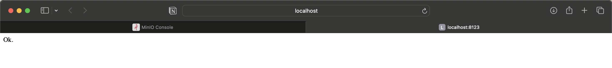
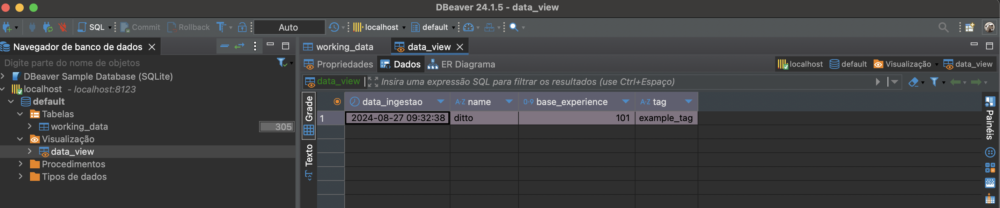

# Pacote de ingestão de dados com python
- Criação de pacote de ingestão de dados de uma API da Pokedéx.
- Armazenamento de dados em um bucket da MinIO, que estará em docker.
## Tecnologias utilizadas
- python
- docker
- MinIO
- ClickHouse
- pytest
- unittest

## Como rodar o projeto
obs: o .env e credenciais foram subidas no repositório com objetivos didáticos para possibilitar que o projeto seja rodado.

- Clonar este repositório
- Abrir um terminal e navegue até a pasta 'src' 
- Rodar o seguinte comando:
-       docker compose up --build
- Acessar o MinIO e Clickhouse pelo localhost em suas respectivas portas:

- Rodar o app.py, no diretório src: 
-       poetry run python3 app.py

- Realize requisições GET: http://localhost:5000/pokemon/pipeline/<nome-pokemon>

- Acessar dados ingeridos no console do MinIO:

- Visualizar tabela e view através do DBeaver:

- Rodar os testes:
-       poetry run pytest
